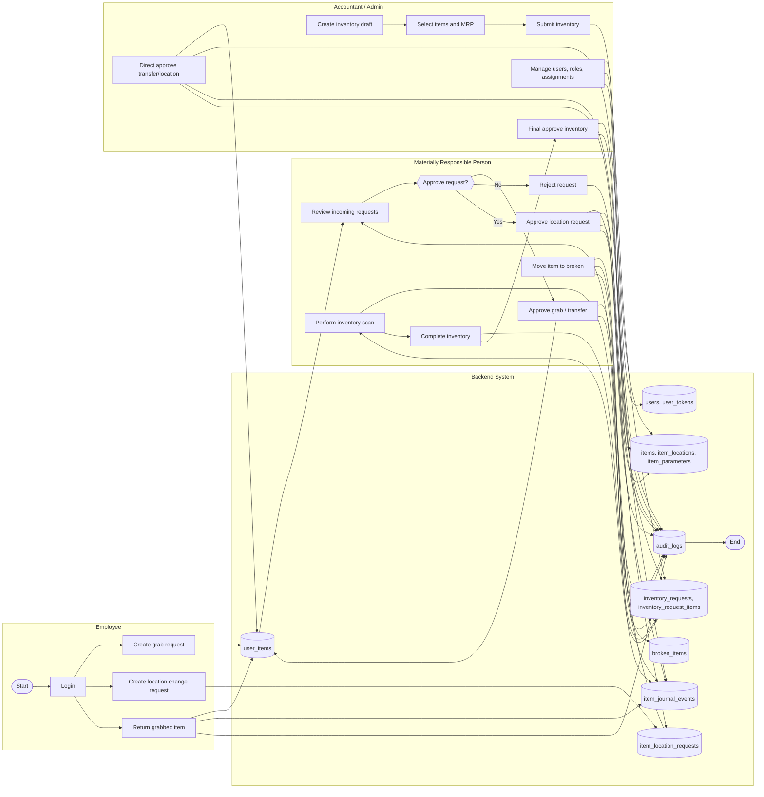

# BPMN: Material Asset Accounting (diploma_backend)

## Notes

- Role gates are enforced in service layer (`Default*Service`).
- Controllers are HTTP-only (decode/call service/map error/audit).
- Repositories isolate DB access (Fluent).
- Journaling (`item_journal_events`) stores domain events; `audit_logs` stores API audit trail.
