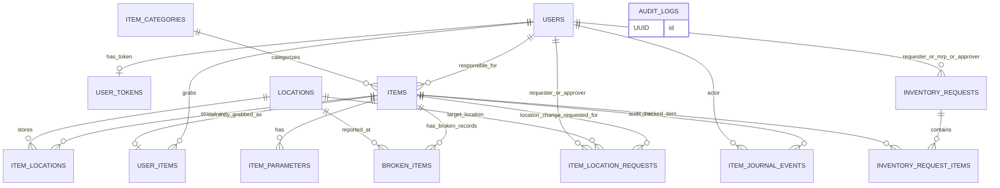

# Database Relationship Diagrams

## Infologic diagram (high-level relationships)



## Datalogic diagram (physical tables, PK/FK, key fields)

```mermaid
erDiagram
    USERS {
        UUID id PK
        string login UK
        string password_hash
        string full_name
        int age
        string position
        string role
    }

    USER_TOKENS {
        UUID id PK
        string value UK
        UUID user_id FK UK
        datetime created_at
        datetime expires_at
    }

    ITEM_CATEGORIES {
        UUID id PK
        string name UK
        string description
    }

    ITEMS {
        UUID id PK
        string number UK
        string name
        string description
        numeric price_rub
        UUID category_id FK
        UUID responsible_user_id FK
    }

    ITEM_PARAMETERS {
        UUID id PK
        UUID item_id FK
        string key
        string value
    }

    LOCATIONS {
        UUID id PK
        string name
        string kind
        string address
        string shelf
        string row
        string section
    }

    ITEM_LOCATIONS {
        UUID id PK
        UUID item_id FK
        UUID location_id FK
        datetime created_at
        datetime updated_at
    }

    USER_ITEMS {
        UUID id PK
        UUID user_id FK
        UUID item_id FK UK
        string status
        UUID approved_by_user_id FK
        UUID requested_to_user_id FK
        datetime grabbed_at
    }

    BROKEN_ITEMS {
        UUID id PK
        UUID item_id FK
        UUID location_id FK
        int quantity
        datetime reported_at
        string reason
        string notes
    }

    ITEM_LOCATION_REQUESTS {
        UUID id PK
        UUID item_id FK
        UUID location_id FK
        UUID requester_user_id FK
        UUID requested_to_user_id FK
        UUID approved_by_user_id FK
        string status
        datetime created_at
        datetime updated_at
    }

    ITEM_JOURNAL_EVENTS {
        UUID id PK
        UUID item_id FK
        UUID actor_user_id FK
        string event_type
        string message
        datetime created_at
    }

    INVENTORY_REQUESTS {
        UUID id PK
        UUID requester_user_id FK
        UUID materially_responsible_user_id FK
        date inventory_date
        string status
        datetime submitted_at
        datetime mrp_completed_at
        UUID mrp_completed_by_user_id FK
        datetime final_approved_at
        UUID final_approved_by_user_id FK
        datetime created_at
        datetime updated_at
    }

    INVENTORY_REQUEST_ITEMS {
        UUID id PK
        UUID request_id FK
        UUID item_id FK
        string item_number_snapshot
        string item_name_snapshot
        string status
        datetime scanned_at
        UUID scanned_by_user_id FK
        UUID scanned_item_id
        datetime created_at
        datetime updated_at
    }

    AUDIT_LOGS {
        UUID id PK
        string action
        string entity
        UUID entity_id
        string message
        string metadata
        datetime created_at
    }

    USERS ||--o| USER_TOKENS : "user_id (CASCADE)"

    ITEM_CATEGORIES ||--o{ ITEMS : "category_id (SET NULL)"
    USERS ||--o{ ITEMS : "responsible_user_id (SET NULL)"

    ITEMS ||--o{ ITEM_PARAMETERS : "item_id (CASCADE)"

    ITEMS ||--o{ ITEM_LOCATIONS : "item_id (CASCADE)"
    LOCATIONS ||--o{ ITEM_LOCATIONS : "location_id (CASCADE)"

    USERS ||--o{ USER_ITEMS : "user_id (CASCADE)"
    ITEMS ||--o| USER_ITEMS : "item_id unique (RESTRICT)"
    USERS ||--o{ USER_ITEMS : "approved_by_user_id (SET NULL)"
    USERS ||--o{ USER_ITEMS : "requested_to_user_id (SET NULL)"

    ITEMS ||--o{ BROKEN_ITEMS : "item_id (RESTRICT)"
    LOCATIONS ||--o{ BROKEN_ITEMS : "location_id (RESTRICT)"

    ITEMS ||--o{ ITEM_LOCATION_REQUESTS : "item_id (CASCADE)"
    LOCATIONS ||--o{ ITEM_LOCATION_REQUESTS : "location_id (CASCADE)"
    USERS ||--o{ ITEM_LOCATION_REQUESTS : "requester_user_id (CASCADE)"
    USERS ||--o{ ITEM_LOCATION_REQUESTS : "requested_to_user_id (SET NULL)"
    USERS ||--o{ ITEM_LOCATION_REQUESTS : "approved_by_user_id (SET NULL)"

    ITEMS ||--o{ ITEM_JOURNAL_EVENTS : "item_id (CASCADE)"
    USERS ||--o{ ITEM_JOURNAL_EVENTS : "actor_user_id (SET NULL)"

    USERS ||--o{ INVENTORY_REQUESTS : "requester_user_id (RESTRICT)"
    USERS ||--o{ INVENTORY_REQUESTS : "materially_responsible_user_id (RESTRICT)"
    USERS ||--o{ INVENTORY_REQUESTS : "mrp_completed_by_user_id (SET NULL)"
    USERS ||--o{ INVENTORY_REQUESTS : "final_approved_by_user_id (SET NULL)"

    INVENTORY_REQUESTS ||--o{ INVENTORY_REQUEST_ITEMS : "request_id (CASCADE)"
    ITEMS ||--o{ INVENTORY_REQUEST_ITEMS : "item_id (RESTRICT)"
    USERS ||--o{ INVENTORY_REQUEST_ITEMS : "scanned_by_user_id (SET NULL)"
```

## Notes

- `inventory_request_items.scanned_item_id` is currently a UUID field without an FK constraint.
- `audit_logs` has no hard FK links and can reference any entity via `entity` + `entity_id`.
