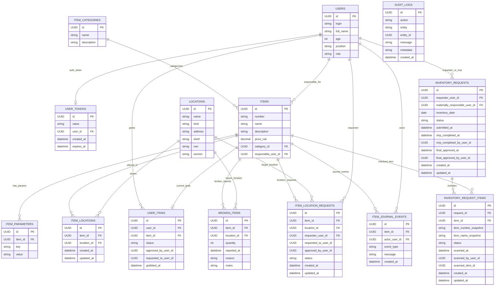

# Logical DB Diagram (Current Schema)

```mermaid
erDiagram
    USERS {
        UUID id PK
        string login
        string full_name
        int age
        string position
        string role
    }

    USER_TOKENS {
        UUID id PK
        string value
        UUID user_id FK
        datetime created_at
        datetime expires_at
    }

    ITEM_CATEGORIES {
        UUID id PK
        string name
        string description
    }

    ITEMS {
        UUID id PK
        string number
        string name
        string description
        decimal price_rub
        UUID category_id FK
        UUID responsible_user_id FK
    }

    ITEM_PARAMETERS {
        UUID id PK
        UUID item_id FK
        string key
        string value
    }

    LOCATIONS {
        UUID id PK
        string name
        string kind
        string address
        string shelf
        string row
        string section
    }

    ITEM_LOCATIONS {
        UUID id PK
        UUID item_id FK
        UUID location_id FK
        datetime created_at
        datetime updated_at
    }

    USER_ITEMS {
        UUID id PK
        UUID user_id FK
        UUID item_id FK
        string status
        UUID approved_by_user_id
        UUID requested_to_user_id
        datetime grabbed_at
    }

    BROKEN_ITEMS {
        UUID id PK
        UUID item_id FK
        UUID location_id FK
        int quantity
        datetime reported_at
        string reason
        string notes
    }

    ITEM_LOCATION_REQUESTS {
        UUID id PK
        UUID item_id FK
        UUID location_id FK
        UUID requester_user_id FK
        UUID requested_to_user_id
        UUID approved_by_user_id
        string status
        datetime created_at
        datetime updated_at
    }

    INVENTORY_REQUESTS {
        UUID id PK
        UUID requester_user_id FK
        UUID materially_responsible_user_id FK
        date inventory_date
        string status
        datetime submitted_at
        datetime mrp_completed_at
        UUID mrp_completed_by_user_id
        datetime final_approved_at
        UUID final_approved_by_user_id
        datetime created_at
        datetime updated_at
    }

    INVENTORY_REQUEST_ITEMS {
        UUID id PK
        UUID request_id FK
        UUID item_id FK
        string item_number_snapshot
        string item_name_snapshot
        string status
        datetime scanned_at
        UUID scanned_by_user_id
        UUID scanned_item_id
        datetime created_at
        datetime updated_at
    }

    ITEM_JOURNAL_EVENTS {
        UUID id PK
        UUID item_id FK
        UUID actor_user_id FK
        string event_type
        string message
        datetime created_at
    }

    AUDIT_LOGS {
        UUID id PK
        string action
        string entity
        UUID entity_id
        string message
        string metadata
        datetime created_at
    }

    USERS ||--o| USER_TOKENS : auth_token

    ITEM_CATEGORIES ||--o{ ITEMS : categorizes
    USERS ||--o{ ITEMS : responsible_for

    ITEMS ||--o{ ITEM_PARAMETERS : has_params
    ITEMS ||--o{ ITEM_LOCATIONS : placed_in
    LOCATIONS ||--o{ ITEM_LOCATIONS : stores

    USERS ||--o{ USER_ITEMS : grabs
    ITEMS ||--o| USER_ITEMS : current_grab

    ITEMS ||--o{ BROKEN_ITEMS : broken_reports
    LOCATIONS ||--o{ BROKEN_ITEMS : report_location

    ITEMS ||--o{ ITEM_LOCATION_REQUESTS : location_requests
    LOCATIONS ||--o{ ITEM_LOCATION_REQUESTS : target_location
    USERS ||--o{ ITEM_LOCATION_REQUESTS : requester

    ITEMS ||--o{ ITEM_JOURNAL_EVENTS : journal_events
    USERS ||--o{ ITEM_JOURNAL_EVENTS : actor

    USERS ||--o{ INVENTORY_REQUESTS : requester_or_mrp
    INVENTORY_REQUESTS ||--o{ INVENTORY_REQUEST_ITEMS : includes
    ITEMS ||--o{ INVENTORY_REQUEST_ITEMS : checked_item
```
